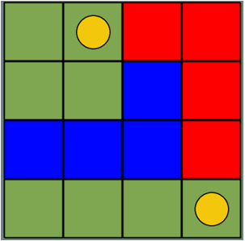

# The-L-game-AI
This repository provides the L game board with AI bot.

The L game was invented in 1967 by Edward de Bonno. It is a two-person zero sum game with perfect information. The objective of the game is to make a move that will leave your opponent without any place to put its L piece.

## Playing the game:

The initial state of the game is as the following:

 

Then the first player needs to: 
1. Move its own L piece to a different position, where at least 1 square is different from the previous position. 
2. Only after moving the L piece, the player can choose to place or not, any of the two coins in a new position. 

##### Example of a valid move where the red player starts the game:

In the sequence, the second player will need to perform the same steps: move the L piece and move or not the coin. 
**If at some point, the player does not have a place to move its L piece, it loses.**

##### Example of a final state where the red player needs to move its piece, but can’t, so the blue player won:

## Running the game:
Simply clone this repository and run this command on the root folder:
* python3 main.py (Linux/Mac)
* python main.py (Windows)

It might be necessary to install Python and its libraries. 
Usually _pip_ or _pip3_ does the job. More info here: https://www.python.org/downloads/

#### Have fun and good luck trying to beat the bot ;)